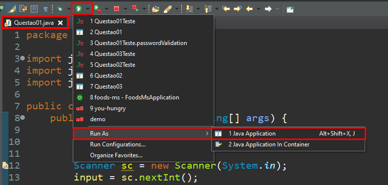
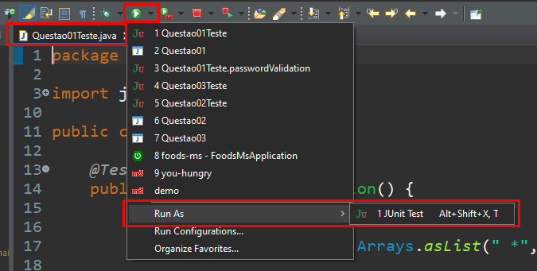

# desafio-capgemini

Repositório criado para a seleção da **Academia de Java da Capgemini**

### Passos para executar o projeto
Para executar esse projeto, é necessário um computador com uma versão do JDK intalada e uma IDE de preferência. Após garantir isso, siga os passos abaixo.

1. Clonar o projeto
2. Importar o mesmo para a IDE
3. Selecionar qual das questões você deseja executar e rodar como uma aplicação Java

### Passos para executar os testes do projeto

1. Com o projeto já importado na IDE de sua preferência, selecione qual dos testes você deseja executar e rode o mesmo como uma aplicação JUnit

